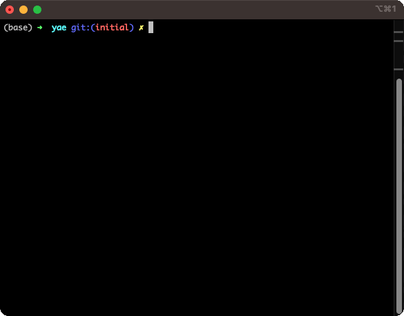

<div align="center">
<h1 align="center">

<br>
</h1>
</div>


yae (yet another env ) is a env getter that fit my needs. It is a very simple package for storing and retrieving secrets using the system keyring for safer storage of credentials during local development. yae also has support for getting environmental variables with or without a prefix. Right now this only support `json` and `yaml` but that could very easily be extended.

## Installation

To install yae, run the following command:

```shell
go get github.com/johnmikee/yae
```

## Usage

```go
package main

import (
	"fmt"
	"os"

	"github.com/johnmikee/yae"
)

type Config struct {
	Foo string `json:"foo"`
	Bar string `json:"bar"`
	Baz int    `json:"baz"`
}

func main() {
	var cfg Config
	err := yae.Get(
		yae.EnvType(yae.DEV),
		&yae.Env{
			Name:         "YAE",
			ConfigStruct: &cfg,
			Type:         yae.JSON,
		},
	)
	if err != nil {
		fmt.Println(err.Error())
		os.Exit(1)
	}

	fmt.Println("Bar: ", cfg.Bar)
	fmt.Println("Baz: ", cfg.Baz)
	fmt.Println("Foo: ", cfg.Foo)
}

```

